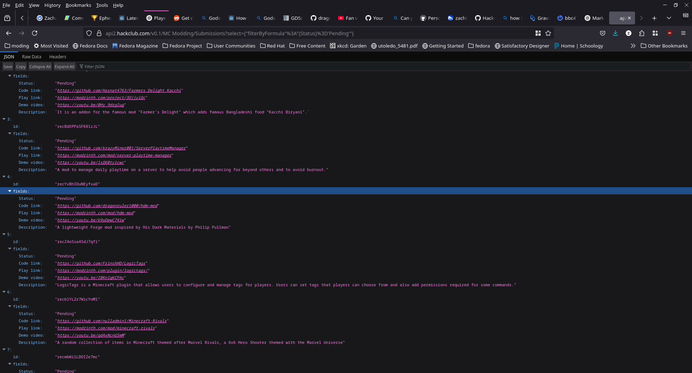
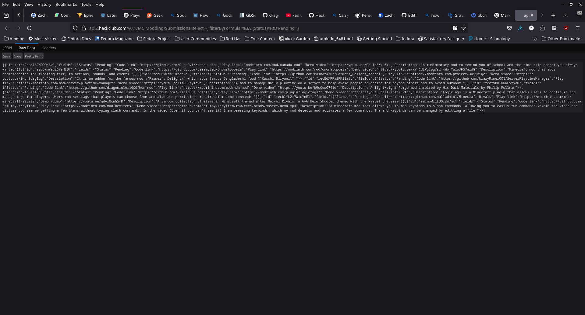

### How to Find and Add Your Mod Submission ID

1. Go to [this link](https://api2.hackclub.com/v0.1/MC%20Modding/Submissions?select=%7B%22filterByFormula%22%3A%22%7BStatus%7D%3D'Pending'%22%7D).

2. Search for your mod:
   - You can filter for your mod by using part of your GitHub repository name or by using the link to your video.

3. Find the `id` field for your submission.

4. Add the `id` to the script.

